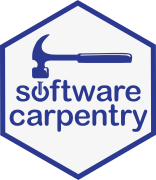

On January 13-15, 2025, the CSU Carpentry Collective is offering a low-cost, three half-day Software Carpentry workshop on programming in R for anyone affiliated with the CSU system. 
 
[The Carpentries](https://carpentries.org/) is a fiscally sponsored project of Community Initiatives. They teach skills that are immediately useful for researchers, using lessons and datasets that allow researchers to quickly apply what they have learned to their own work.
 
The curriculum will cover topics such as data manipulation, creating publication-quality graphics, and project management using RStudio. Participants who complete all three days will receive a certificate of completion and understand the fundamentals of R. 
 
The target audience is anyone from learners who have little to no prior computational experience to those with experience and just want a bit of a refresher, and the instructors put a priority on creating a friendly environment to empower researchers and enable data-driven discovery. Even those with some experience will benefit, as the goal is to teach not only how to do analyses, but how to manage the process to make it as automated and reproducible as possible.
 
Here is a link to the workshop webpage [https://project-da-fanh.github.io/2025-01-13-CSU-online/](https://project-da-fanh.github.io/2025-01-13-CSU-online/) for more information and a link to sign up. Seats are $25 for faculty/staff and $10 for students and space is limited. 
 
Questions? Contact fanh.analytics@gmail.com
 
We hope to see you at the workshop!
 
 
This workshop is supported by the Chico State Data Science Initiative, CSUSB DAWG, and Project DA-FANH [grant no. 2021-77040-34880] from the USDA National Institute of Food and Agriculture. [Project DA-FANH](https://www.dataanalytics4fanh.science/) aims to foster an active, inclusive, and diverse community of learners and instructors that promote and model the importance of software and data in the Food, Agriculture, Natural Resources and Human Sciences.

